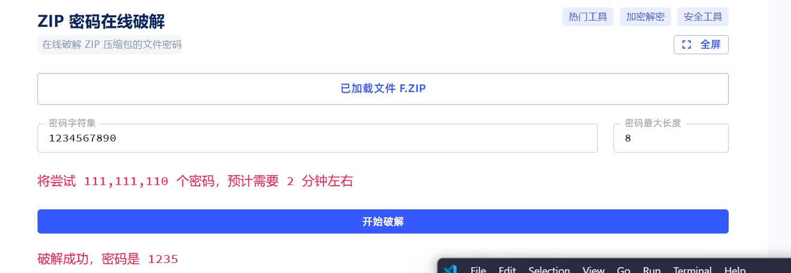
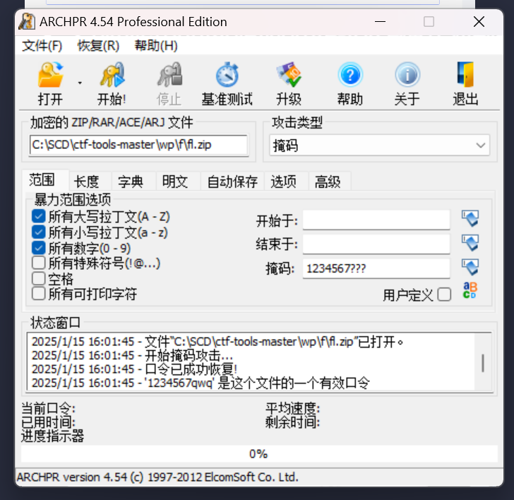
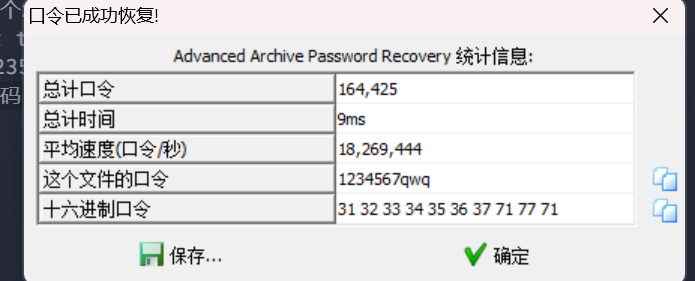
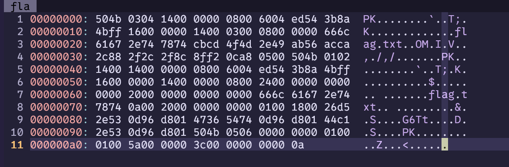

给了一个zip，要密码，直接找个zip密码破解网站  
  
密码1235  
打开密码.txt，前锁定前7位，枚举后3位,掩码攻击  
用这个ARCHPR

密码1234567qwq  
然后呢，还有一个，是伪加密，用vim打开，但是vim不能打开zip文件，但是把.zip删除就可以打开了，就像这样  

然后就是把第二个5040开始，后面第9和第10个字节改成00，保存退出就可以了，解压就有了。
